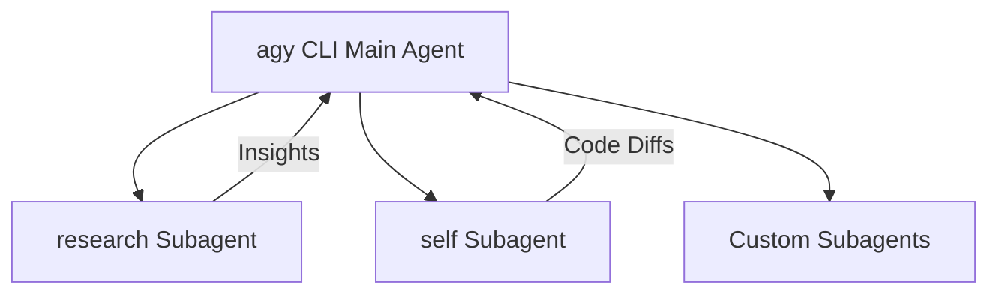

## Getting Started {.cols-3}

### Quick Start {.row-span-2}

```bash
# Launch interactive session in current repository
$ agy

# Resume most recent session
$ agy -c
$ agy --continue

# Resume a specific session by conversation ID
$ agy --conversation <conversation-id>

# Run non-interactive prompt and print output
$ agy -p "explain the architecture of this repo"
$ agy --print "fix lint errors across src/"

# Run prompt and continue interactively
$ agy -i "refactor auth middleware"
$ agy --prompt-interactive "add unit tests"

# Pipe stdin directly to agy
$ git diff | agy -p "write a git commit message"
$ cat logs.txt | agy -p "identify crash trace"

# Multi-directory workspace
$ agy --add-dir ../backend --add-dir ../frontend
```

### Authentication

| Method | Description |
| --- | --- |
| **Google Account** | Run `agy`, follow browser login prompts on first run |
| **Vertex AI (ADC)** | `gcloud auth application-default login` |
| **Service Account** | Set `GOOGLE_APPLICATION_CREDENTIALS=/path/to/sa.json` |
| **Project Selection** | `agy --project <project-id>` or `GOOGLE_CLOUD_PROJECT` |

### Installation Methods

```bash
# Verify installation
$ agy --help

# Configure environment PATH and shell settings
$ agy install

# Update CLI to latest release
$ agy update

# View release notes & changelog
$ agy changelog
```

### Execution Modes

| Mode | Command Flag | Description |
| --- | --- | --- |
| **Default** | *(default)* | Prompts for confirmation before modifying files or running commands |
| **Accept Edits** | `--mode accept-edits` | Automatically applies edits and writes files without prompting |
| **Plan Mode** | `--mode plan` | Formulates step-by-step implementation plans before touching code |
| **Sandbox** | `--sandbox` | Restricts shell execution inside an isolated terminal sandbox |
| **Unrestricted** | `--dangerously-skip-permissions` | Auto-approves all tool permission prompts |

### Key Concepts

- **Agentic Loop**: Dynamically inspects files, runs shell commands, views diffs, and self-corrects based on tool results.
- **Progressive Disclosure**: Skills and contextual rules are loaded on demand rather than cluttering token context.
- **Asynchronous Tasks**: Background commands and multi-agent runs execute concurrently without blocking turns.

---

## CLI Options {.cols-2}

### Core Flags {.row-span-2}

| Flag | Short | Description |
| --- | --- | --- |
| `--print <prompt>` | `-p` | Run prompt non-interactively and print response |
| `--prompt-interactive <prompt>` | `-i` | Run initial prompt and remain interactive |
| `--continue` | `-c` | Resume the most recent conversation |
| `--conversation <id>` | | Resume specific conversation by ID |
| `--model <model>` | | Specify model for the session |
| `--effort <level>` | | Set reasoning effort (`low`, `medium`, `high`) |
| `--mode <mode>` | | Agent mode (`accept-edits`, `plan`) |
| `--sandbox` | | Enable terminal sandbox restrictions |
| `--dangerously-skip-permissions` | | Auto-approve all tool permissions |
| `--add-dir <path>` | | Add directory to workspace (repeatable) |
| `--project <id>` | | Google Cloud / Vertex project ID |
| `--new-project` | | Create a new project for this session |
| `--output-format <format>` | | Output format (`text`, `json`, `stream-json`) |
| `--input-format <format>` | | Input format (`text`, `stream-json`) |
| `--json-schema <schema>` | | Enforce structured JSON schema for outputs |
| `--print-timeout <duration>` | | Timeout limit for print mode (default `0s`) |
| `--log-file <path>` | | Override CLI log file path |
| `--remote-control` | | Connect to remote control background daemon |
| `--disable-slash-commands` | | Disable slash command expansion in print mode |

### Subcommands

```bash
# Manage MCP servers
$ agy mcp [list|add|remove|enable|disable]

# Manage plugins
$ agy plugin [list|install|uninstall|enable|disable|import|validate]

# List supported AI models
$ agy models

# List available agents
$ agy agents

# Manage remote control background daemon
$ agy remote-control [start|status|stop]

# Serve microphone input to a CLI on another host
$ agy mic-serve

# Update agy CLI
$ agy update
```

### Headless & CI/CD Formats

```bash
# Plain text output
$ agy -p "check repo for vulnerabilities" --output-format text

# JSON output for tooling pipelines
$ agy -p "extract exported API endpoints" --output-format json

# NDJSON streaming for real-time consumers
$ agy -p "generate OpenAPI spec" --output-format stream-json

# Enforce structured output via JSON Schema
$ agy -p "list todos" --json-schema schema.json --output-format json
```

---

## Model Selection & Reasoning {.cols-2}

### Models & Reasoning Effort {.row-span-2}

```bash
# Check all available models
$ agy models

# Run with Gemini 3.8 Flash with high reasoning (fast & deep)
$ agy --model gemini-3.8-flash-high

# Run with Gemini 3.1 Pro for complex architectures
$ agy --model gemini-3.1-pro-high

# Run with Claude Sonnet 4.6 (Thinking)
$ agy --model claude-sonnet-4-6

# Specify reasoning effort level
$ agy --effort high
$ agy --effort medium
$ agy --effort low
```

### Model Reference

| Model Identifier | Display Name | Recommended Use |
| --- | --- | --- |
| `gemini-3.8-flash-high` | Gemini 3.8 Flash (High) | Daily coding, rapid agent turns, default |
| `gemini-3.8-flash-medium` | Gemini 3.8 Flash (Medium) | Balanced speed and thinking tokens |
| `gemini-3.8-flash-low` | Gemini 3.8 Flash (Low) | Fastest latency, lightweight queries |
| `gemini-3.7-flash-high` | Gemini 3.7 Flash (High) | Previous generation high reasoning |
| `gemini-3.1-pro-high` | Gemini 3.1 Pro (High) | Massive refactors, cross-repo design |
| `claude-sonnet-4-6` | Claude Sonnet 4.6 | Thinking-enabled coding assistant |
| `claude-opus-4-6-thinking` | Claude Opus 4.6 | Deep complex multi-step reasoning |
| `gpt-oss-120b-medium` | GPT-OSS 120B | Open-weights reasoning tier |

---

## Interactive Slash Commands {.cols-3}

### Slash Commands `/` {.row-span-3}

| Slash Command | Purpose |
| --- | --- |
| `/help` | Show available slash commands and keybindings |
| `/plan` | Formulate a multi-step design & plan before execution |
| `/goal` | Autonomous mode: runs until goal is completed |
| `/boost` | Deep thinking, multi-angle exploration, rigorous checks |
| `/browser` | Web automation, page inspection, and live testing |
| `/grill-me` | Interactive interview to settle design decisions |
| `/schedule` | Set a one-off timer or recurring cron schedule |
| `/teamwork-preview` | Autonomous multi-agent collaboration |
| `/learn` | Persist developer preferences and lessons |
| `/exit` | Exit the CLI session |
| `/quit` | Alias for `/exit` |

### Goal & Boost Modes

```bash
# Inside interactive agy:
> /goal Implement end-to-end tests for billing API and verify they pass

# Boost mode for mission-critical changes:
> /boost Review security implications of session token rotation
```

### Interactive Interviews

```bash
# Challenge your assumptions before writing code
> /grill-me I want to migrate our database from MongoDB to Postgres
```

---

## Keyboard Shortcuts {.cols-3}

### General Controls {.row-span-2}

| Keybinding | Action |
| --- | --- |
| `Ctrl+D Ctrl+D` | Exit agy CLI session |
| `Ctrl+C` | Cancel currently running agent turn or streaming response |
| `Enter` | Submit prompt / send message |
| `Shift+Enter` | Insert a newline into multiline input |
| `Alt+Enter` | Insert a newline into multiline input |

### Input Navigation

| Keybinding | Action |
| --- | --- |
| `Up` / `Down` | Browse prompt history |
| `Ctrl+A` | Move cursor to beginning of line |
| `Ctrl+E` | Move cursor to end of line |
| `Ctrl+U` | Delete from cursor to start of line |
| `Ctrl+K` | Delete from cursor to end of line |
| `Ctrl+L` | Clear terminal screen |

### Agent Control

| Action | How |
| --- | --- |
| **Accept Edit** | Press `Enter` or click Approve on tool prompt |
| **Reject Edit** | Press `Esc` or type feedback |
| **Interrupt** | `Ctrl+C` halts tool call immediately |

---

## Subagents & Delegation {.cols-2}

### Subagent Architecture {.row-span-2}

Antigravity CLI can invoke specialized subagents that execute concurrently with their own contexts and workspaces:



- **Isolated Context**: Subagents keep the main turn's context window clean and concise.
- **Parallel Work**: Background subagents report results automatically without polling.
- **Workspace Modes**:
  - `inherit`: Shares current project workspace.
  - `branch`: Creates an isolated git worktree branch.
  - `share`: Uses shared repository cache without copying storage.

### Built-in Subagent Types

| Subagent | Scope | Purpose |
| --- | --- | --- |
| `research` | Read-only | Web search, codebase exploration, documentation analysis |
| `self` | Full tools | Inherits parent tools to run parallel branch edits |
| `custom` | Configurable | Defined dynamically via `define_subagent` |

---

## MCP Servers (Model Context Protocol) {.cols-2}

### Managing MCP Servers {.row-span-2}

Antigravity natively integrates MCP servers to connect your agent to external databases, APIs, and devtools:

```bash
# List configured MCP servers
$ agy mcp list

# Add local process (stdio) MCP server
$ agy mcp add postgres npx -y @modelcontextprotocol/server-postgres "postgresql://localhost/db"

# Add HTTP / SSE MCP server
$ agy mcp add weather https://api.weather-mcp.internal/sse

# Disable an MCP server temporarily
$ agy mcp disable postgres

# Re-enable an MCP server
$ agy mcp enable postgres

# Remove an MCP server
$ agy mcp remove postgres
```

### Configuration & Tool Loading

Servers are stored in `~/.gemini/antigravity-cli/mcp/<serverName>/`:

- **Eager Tools**: Automatically loaded into native agent tool registry.
- **Lazy Tools**: Registered on-demand via schemas (`<toolName>.json`) to conserve prompt tokens.
- **Instructions**: Optional `instructions.md` guide agent when and how to call tools.

---

## Customization: Rules & Skills {.cols-3}

### Hierarchical Rules {.row-span-2}

Rules guide coding standards and instructions automatically:

- **Project Root**: `GEMINI.md`, `AGENTS.md`
- **Scoped Rules**: `.agents/rules/*.md` or `.gemini/rules/`
- **Hierarchical Discovery**: Traverses from active file up to git root.

```markdown
<!-- GEMINI.md example -->
# Project Guidelines
- Always use TypeScript strict mode.
- Write tests with Vitest in tests/ directory.
```

### Agent Skills

Skills teach reusable workflows and procedures:

- Located in `.agents/skills/<name>/SKILL.md` or `~/.gemini/config/skills/`.
- Loaded dynamically via **Progressive Disclosure** (only activated when relevant).

```yaml
---
name: deploy-preview
description: Deploy branch to preview environment and run smoke tests
---
# Runbook steps here...
```

### Precedence Order

1. Workspace Project (`.agents/`)
2. Workspace Declared (`skills.json`, `plugins.json`)
3. Global User Config (`~/.gemini/config/`)
4. Built-in Applications & Skills
5. Global Declared Config

---

## Plugins & Extensions {.cols-2}

### Managing Plugins {.row-span-2}

Plugins bundle skills, rules, hooks, and MCP servers into installable units:

```bash
# List all installed plugins
$ agy plugin list

# Install from registry or marketplace
$ agy plugin install security-auditor@marketplace

# Install local plugin package
$ agy plugin install ./my-plugin

# Import plugins from Claude or Gemini configs
$ agy plugin import gemini
$ agy plugin import claude

# Validate plugin manifest and schema
$ agy plugin validate ./my-plugin

# Enable / Disable a plugin
$ agy plugin enable security-auditor
$ agy plugin disable security-auditor

# Uninstall plugin
$ agy plugin uninstall security-auditor
```

### Plugin Structure

```
my-plugin/
├── plugin.json       # Manifest (name, version, entrypoints)
├── skills/           # Custom agent skills
│   └── audit/SKILL.md
├── rules/            # Custom rules and guidelines
│   └── security.md
└── mcp_config.json   # Bundled MCP server definitions
```

---

## Configuration & Brain Storage {.cols-2}

### Configuration Locations {.row-span-2}

| Scope | Path | Purpose |
| --- | --- | --- |
| **CLI Settings** | `~/.gemini/antigravity-cli/settings.json` | Global CLI preferences, default model, reasoning |
| **Global Config** | `~/.gemini/config/` | User-wide skills, rules, and plugins |
| **Workspace Config** | `.agents/` or `.gemini/` | Project-scoped rules and agent configurations |
| **Sessions & Brain** | `~/.gemini/antigravity-cli/brain/<session-id>/` | Transcripts, tasks, and generated artifacts |

### Example `settings.json`

```json
{
  "model": "gemini-3.8-flash-high",
  "effort": "high",
  "mode": "accept-edits",
  "telemetry": false
}
```

### Transcripts & Artifacts

- Transcripts stored in `brain/<id>/.system_generated/logs/transcript.jsonl`.
- Markdown artifacts and diff reports stored in `brain/<id>/`.

---

## Also see {.cols-1}

- [Official Antigravity Documentation](https://antigravity.google/docs) _(antigravity.google)_
- [CLI Reference Guide](https://antigravity.google/docs/cli/reference) _(antigravity.google)_
- [CLI Features & Subagents](https://antigravity.google/docs/cli/features) _(antigravity.google)_
- [Skills Documentation](https://antigravity.google/docs/skills) _(antigravity.google)_
- [Rules & Guidelines Guide](https://antigravity.google/docs/rules-workflows) _(antigravity.google)_
- [Model Context Protocol (MCP)](https://antigravity.google/docs/mcp) _(antigravity.google)_
- [Antigravity Python SDK](https://github.com/google-antigravity/antigravity-sdk-python) _(github.com)_
